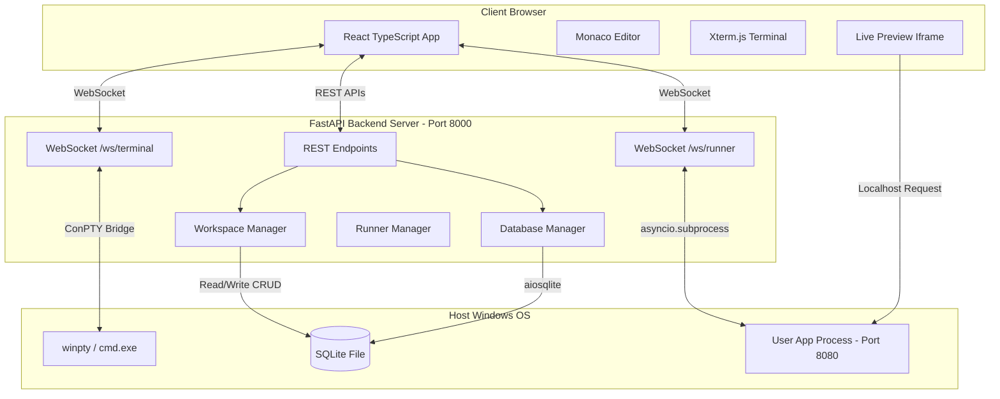

# Full‑Stack Web IDE Application (FastAPI & React)

A premium, high-fidelity browser-based IDE that lets users write, execute, and manage Python-based web applications (Django, Flask, FastAPI) directly inside the browser. It features a file explorer, tabbed Monaco code editor, interactive pseudoterminal (ConPTY), background process logs console, SQLite database viewer, and a side-by-side Live Preview sandbox.

---

## 1. Project Architecture

The workspace is split into three main components: a **React Frontend**, a **FastAPI Backend Server**, and an isolated **Projects workspace folder**.



---

## 2. Directory Structure

```text
Yuvro/
│
├── backend/                  # FastAPI Application
│   ├── main.py               # API endpoints & WebSocket handlers
│   ├── workspace_manager.py  # File CRUD, git cloning, boilerplate generation
│   ├── runner.py             # Subprocess execution and logs collector
│   ├── db_manager.py         # SQLite connection, schema explorer, read-only runner
│   └── requirements.txt      # Python dependencies
│
├── frontend/                 # React Application
│   ├── public/               # Static icons & SVGs
│   ├── src/
│   │   ├── components/
│   │   │   ├── FileExplorer.tsx  # Project files navigation & CRUD
│   │   │   ├── Terminal.tsx      # Xterm.js terminal client
│   │   │   ├── Runner.tsx        # Command settings & logs viewer
│   │   │   └── DbViewer.tsx      # SQLite schema explorer & SQL queries console
│   │   ├── App.tsx           # Global state & resizable layout coordinator
│   │   ├── index.css         # Styling system & custom UI variables
│   │   └── main.tsx          # React entry point
│   ├── package.json          # Node dependencies
│   └── vite.config.ts        # Vite configuration
│
├── projects/                 # Isolated directory where user projects are created/cloned
│   └── test-fastapi-app/     # Sample FastAPI application database & scripts
│
└── README.md                 # Project documentation
```

---

## 3. Key Features

- **Project Workspace & Explorer**: Create new projects from templates (FastAPI, Flask, Django) or clone public GitHub repositories directly. Navigation supports folder structures, file creation, deleting, and renaming.
- **Monaco Code Editor**: Fully integrated Monaco editor supporting Python, HTML, CSS, JavaScript, and Markdown syntax highlighting. Features a modifications cache and `Ctrl+S` keyboard save mappings.
- **Interactive Terminal (PTY)**: Utilizes native Windows ConPTY wrappers (`pywinpty`) to run `cmd.exe` in the backend, supporting interactive keys, ANSI colors, and tab-completion in xterm.js.
- **Server Runner & Logs**: Spawns user web servers using asynchronous subprocesses, captures output streams line-by-line, and displays them on a scrolling logs console.
- **SQLite Database Viewer**: Recursively scans projects for SQLite database files (`.db`, `.sqlite3`), extracts column type schemas, shows table row counts, and features a paginated browse grid.
- **Safe SQL Runner**: Allows writing custom SQL statements inside the browser. Restricts commands to read-only `SELECT` queries at both the query parsing level and connection level (`mode=ro`).
- **Live Preview Panel**: Points to the running application port (e.g. `8080`) side-by-side using an iframe, with manual refresh controls.

---

## 4. API Reference

### REST Endpoints
| Method | Endpoint | Description | Query / Body Parameters |
| :--- | :--- | :--- | :--- |
| **GET** | `/api/projects` | List all project folders | None |
| **POST** | `/api/projects/create` | Create a new project template | `{ "name": "...", "template": "django/flask/fastapi" }` |
| **POST** | `/api/projects/clone` | Clone a Git repository | `{ "name": "...", "repoUrl": "..." }` |
| **GET** | `/api/files/tree` | Fetch hierarchical file tree | `?project=projectName` |
| **GET** | `/api/files/read` | Read contents of a file | `?project=projectName&path=filePath` |
| **POST** | `/api/files/write` | Write content to a file | `?project=projectName&path=filePath` Body: `{ "content": "..." }` |
| **POST** | `/api/files/create` | Create new file or folder | `?project=projectName` Body: `{ "path": "...", "isFolder": true/false }` |
| **POST** | `/api/files/delete` | Delete file or folder | `?project=projectName&path=filePath` |
| **POST** | `/api/files/rename` | Rename file or folder | `?project=projectName` Body: `{ "oldPath": "...", "newPath": "..." }` |
| **GET** | `/api/db/list` | Scan and list SQLite files | `?project=projectName` |
| **GET** | `/api/db/tables` | Get tables and row counts | `?project=projectName&dbPath=relativeDbPath` |
| **GET** | `/api/db/schema` | Get table columns and schemas | `?project=projectName&dbPath=relativeDbPath&table=tableName` |
| **GET** | `/api/db/rows` | Fetch paginated table rows | `?project=projectName&dbPath=relativeDbPath&table=tableName&limit=50&offset=0` |
| **POST** | `/api/db/query` | Run custom SELECT query | `?project=projectName&dbPath=relativeDbPath` Body: `{ "query": "..." }` |

### WebSockets
| Endpoint | Description | Protocol |
| :--- | :--- | :--- |
| `/ws/terminal?project=projectName` | Shell interactive terminal input/output bridge | Raw text / JSON resize messages |
| `/ws/runner/{projectName}` | Start/stop server process runner and stream stdout/stderr logs | JSON actions (`start`, `stop`, `restart`) |

---

## 5. Quickstart Setup

### Prerequisites
- Python 3.12+ (ensure it is added to your environment `PATH`)
- Node.js v22+ & npm

### Setup Step 1: Start Backend
Navigate to the `backend` folder, install requirements, and run the server:
```powershell
cd backend
pip install -r requirements.txt
python main.py
```
*The FastAPI backend will start running on `http://127.0.0.1:8000`.*

### Setup Step 2: Start Frontend
Open a new terminal session, navigate to the `frontend` folder, install Node packages, and start the development server:
```powershell
cd frontend
npm install
npm run dev
```
*The React dev server will start running on `http://localhost:5173`.*

---

## 6. Verification Guide & Loom Presentation Flow

If you are preparing a demo video for submission, follow these steps:

1. **Open the IDE**: Open `http://localhost:5173/` in your browser. Show the slate/indigo dashboard theme.
2. **Load Project**: Click the Project dropdown at the top, select `test-fastapi-app`. The file tree will immediately render.
3. **Edit Code**: Open `main.py` from the file tree, edit the HTML title string on line 94 to your custom title, and click the **Save** button in the header (or press `Ctrl+S`).
4. **Boot Server**: Click the **Server Logs** tab. In the **PORT** input box, change it to `8080` (this automatically updates the command to `--port 8080`). Click **Start**. The console will print the starting server logs.
5. **Inspect Preview**: Look at the right **Live Preview** pane showing the loaded homepage of your app, displaying your HTML modifications. Click the Reload icon to show preview sync.
6. **Browse SQLite Tables**: Select the **Database** explorer tab in the Left Sidebar. Click on `todos` table under `app.db`.
7. **Run SQL Queries**: In the **SQLite Query Grid** console tab, inspect the rows. In the query console text area, run `SELECT * FROM todos WHERE completed = 0;` and inspect the filtered grid results.
8. **Interactive Terminal**: Select the **Interactive Terminal** tab. Click inside and run `dir` or `python -V` to show CMD interactive shell integrations.
9. **Process Stop**: Go back to **Server Logs** and click **Stop** to show background subprocess termination.
