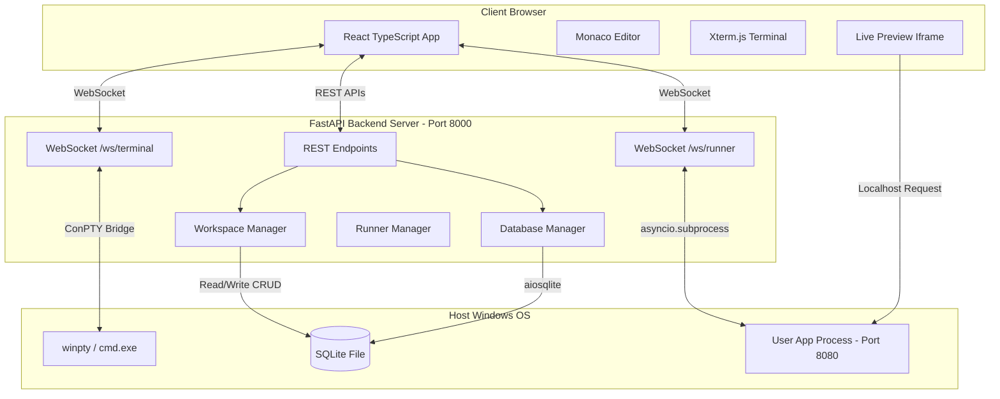

# Full‑Stack Web IDE Application (FastAPI & React)

A premium, high-fidelity full-stack web IDE that allows users to create, clone, edit, run, and manage Python-based web applications (Django, Flask, FastAPI) directly inside the browser. It features a file explorer, tabbed Monaco code editor, interactive pseudoterminal (ConPTY), background process logs console, database explorer for SQLite, and a side-by-side Live Preview pane.

## Architecture Diagram

The workspace is split into three main components: a **React Frontend**, a **FastAPI Backend Server**, and an isolated **Projects workspace folder**.



---

## Key Features

- **Project Explorer & Creator**: Create blank FastAPI, Flask, or Django template projects, or clone any public GitHub repository directly.
- **Code Editor (Monaco)**: Features full Python/HTML/CSS syntax highlighting, tabbed workspace layout, modifications cache, and custom `Ctrl+S` keyboard save mappings.
- **Interactive Terminal (ConPTY)**: Utilizes native Windows ConPTY wrappers (`pywinpty`) to run `cmd.exe` in the backend, supporting interactive key entry, ANSI color outputs, and tab-completion.
- **Process Runner & Logs**: Asynchronously spawns user web servers in isolated environments, reads output line-by-line using non-blocking queues, and routes them to a real-time console.
- **SQLite Database Viewer**: Recursively detects SQLite database files in projects. Provides a paginated grid to browse tables and a read-only SQL query console.
- **Live Preview Sandbox**: Allows users to preview their active servers via a side-by-side iframe sandbox with reload functionalities.

---

## Tech Stack

### Frontend
1. **React & TypeScript**: Scalable layout state management and structured models.
2. **Monaco Editor (`@monaco-editor/react`)**: The engine behind VS Code, providing syntax styling.
3. **Xterm.js (`xterm`, `xterm-addon-fit`)**: Terminal engine with dynamic grid resizing.
4. **Vanilla CSS**: Curated Indigo & Slate colors, resizable column borders, and micro-animations.

### Backend
1. **FastAPI & Uvicorn**: High-performance HTTP and WebSocket router.
2. **PyWinPTY**: Windows pseudo-terminal binder interfacing with `cmd.exe`.
3. **aiosqlite**: Non-blocking SQLite queries.
4. **GitPython**: Git repository management.

---

## Quickstart Setup

### Prerequisites
- Python 3.12+ (ensure it is added to your environment `PATH`)
- Node.js v22+ & npm

### Setup Step 1: Start Backend
Navigate to the `backend` folder, install requirements, and run the server:
```powershell
cd backend
pip install -r requirements.txt
python main.py
```
*The FastAPI backend will start running on `http://127.0.0.1:8000`.*

### Setup Step 2: Start Frontend
Open a new terminal session, navigate to the `frontend` folder, install Node packages, and start the development server:
```powershell
cd frontend
npm install
npm run dev
```
*The React dev server will spin up on `http://localhost:5173`.*

---

## Verification Guide
1. Open your browser to `http://localhost:5173/`.
2. Select `test-fastapi-app` from the top project selector or create a new project.
3. Edit `main.py` inside the Monaco editor, and save your changes.
4. Switch the console panel tab to **Server Logs**, select port **8080**, and click **Start** to run Uvicorn.
5. Inspect the live logs, then check the right **Live Preview** pane to see the web app running.
6. Connect database files, check table rows inside the **SQLite Query Grid** tab, and execute custom SQL statements.
7. Open **Interactive Terminal** and execute commands (e.g. `dir`, `pip list`).
